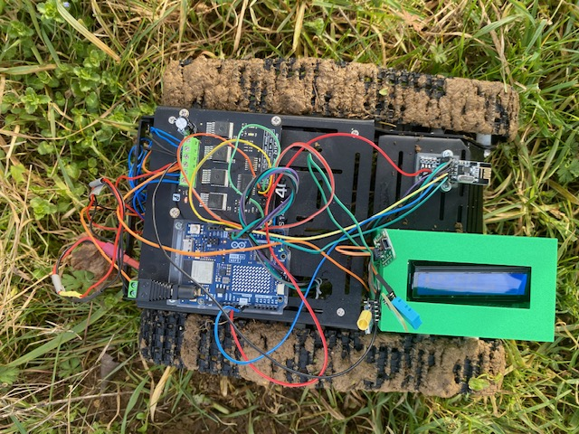
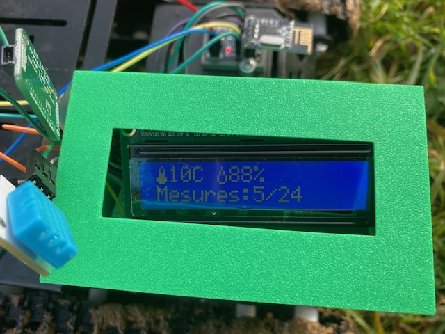

# 🍇 Mildiou-AI-Rover: Autonomous Agricultural Prediction System (Edge AI)


<div align="center">
  
</div>

## 📖 Overview

**Mildiou-AI** is a comprehensive IoT solution designed for precision viticulture. It is an embedded system capable of predicting **Downy Mildew** (Mildiou) risks 24 to 48 hours in advance by analyzing the local micro-climate using an **Artificial Neural Network (ANN)** running directly on a microcontroller (Edge Computing).

The system is mounted on a remote-controlled **All-Terrain Rover** to perform localized measurements and transmits its analysis via **LoRa** (Long Range) to a supervision station, without requiring an Internet connection.

---

## ⚙️ System Architecture

The project consists of three independent, interconnected units:

### 1. Analysis Unit (The Rover)

The "brain" of the system, embedded on the robot.

| Component | Description |
|-----------|-------------|
| **Hardware** | Arduino UNO R4 WiFi (Renesas 32-bit) |
| **Sensors** | DHT11 (Temp/Hum), LPS25 (Atmospheric Pressure) |
| **Intelligence** | Feedforward Neural Network (MLP) coded in native C++ |
| **Comms** | LoRa RYLR998 (Long-range) + NRF24L01 (Control reception) |

### 2. Control Unit (The Remote)

Ergonomic interface for rover mobility.

| Component | Description |
|-----------|-------------|
| **Hardware** | Arduino Nano |
| **Comms** | NRF24L01 (2.4 GHz) for low-latency real-time control |
| **Input** | Dual Analog Joystick (Tank Drive mixing) |

### 3. Supervision Station (The Display)

Fixed user interface for reading risk levels.



| Component | Description |
|-----------|-------------|
| **Hardware** | Arduino UNO R3 + DFRobot LCD12864 Shield |
| **Display** | Graphical rendering via `U8glib` library (ST7565/NHD Mode) |
| **Function** | Asynchronous reception of LoRa packets and visual alerts |

---

## 🧠 Embedded Artificial Intelligence

The core of the project is a dense neural network (Deep Learning) optimized for memory-constrained microcontrollers.

### Model Architecture

We use a "Funnel" structure to extract complex climatic features:

| Layer | Neurons | Role |
|-------|---------|------|
| **Input** | 25 | Raw data + 3-day Trends + Moving Averages |
| **Hidden 1** | 20 | Pattern Recognition |
| **Hidden 2** | 10 | Temporal Abstraction |
| **Output** | 3 | Softmax Classification → [Low, Medium, High] |

### Training Pipeline

1. **Training:** Model trained on PC (Python/TensorFlow) using a 1400-day dataset.
2. **Export:** Conversion of `weights` and `biases` into a C++ header file (`.h`).
3. **Inference:** Real-time matrix calculation on the Arduino R4.
4. **Active Learning:** A "Human-in-the-loop" system allowing prediction errors to be stored in EEPROM for future model re-training.

---

## 📂 Repository Structure

Here is the organization of the project source code:

```text
/Mildiou-AI-Rover
│
├── /firmware                      # C++ source code for microcontrollers
│   ├── /mildiou_station           # MAIN CODE (Arduino R4)
│   │   ├── mildiou_prod.ino       # Business logic: Sensors, AI, LoRa
│   │   └── mildiou_nn_weights.h   # Neural Network "Synapses" (Generated by Python)
│   │
│   ├── /recepteur_display         # Supervision Screen Code (Arduino R3)
│   │   └── Recepteur_Display.ino
│   │
│   ├── /recepteur_rover           # Robot Motor Code (Arduino R4/Motor Driver)
│   │   └── Recepteur_Rover.ino
│   │
│   └── /emetteur_manette          # Remote Control Code (Arduino Nano)
│       └── Emetteur_Manette.ino
│
├── /training                      # Data Science & Machine Learning
│   ├── pipeline_v3.py             # Python Script: AI Training + C++ Generation
│   ├── dataset.csv                # Historical climate data (Sample)
│   └── requirements.txt           # Python dependencies list
│
└── /docs                          # Documentation, Schematics, 3D Photos
```

---

## 🚀 Installation & Setup

### Hardware Prerequisites

- Arduino IDE 2.0+
- Python 3.8+ (for re-training)

### 1. Flashing Microcontrollers

Each subfolder in `/firmware` corresponds to a specific board.

1. Open the `.ino` file in Arduino IDE.
2. Install the required libraries (see Credits section).
3. Select the correct **Board** and **Upload**.

### 2. AI Training (Optional)

If you wish to update the robot's brain with your own data:

```bash
cd training
pip install -r requirements.txt
python pipeline_v3.py
```

> This will generate a new `mildiou_nn_weights.h` file to replace in the `/firmware/mildiou_station` folder.

---

## 🔮 Roadmap & Future Improvements

- [ ] **Power Optimization:** Migration to "Deep Sleep" logic for solar autonomy.
- [ ] **Data Logging:** Adding an SD Card module for long-term local archiving.
- [ ] **ESP32 Migration:** Porting code to leverage dual-core architecture (AI on Core 0, Radio on Core 1).

---

## 🤝 Credits & Libraries

| Library | Author | Usage |
|---------|--------|-------|
| `U8glib` | Oliver Kraus | Graphic display management |
| `RF24` | TMRh20 | 2.4GHz radio communication |
| `DHT Sensor Library` | Adafruit | Temp/Hum reading |
| `LPS25` | Pololu | Barometer driver |

---

> 🍇 *Project realized as part of an IoT Engineering curriculum.*
>
> 📧 Contact: [GitHub](https://github.com/gtom-pandas) | [Kaggle](https://www.kaggle.com/ttgrcgrc)
